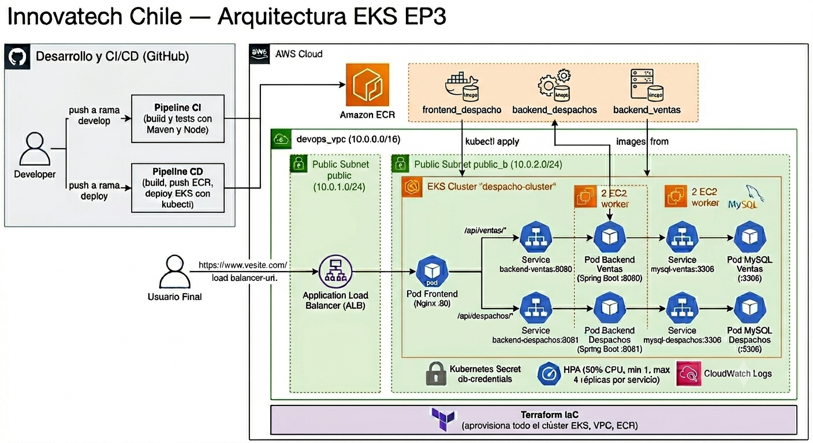

# Innovatech Chile — Sistema de Gestión de Despachos

> Sistema de gestión de despachos y ventas desarrollado con arquitectura de microservicios, desplegado en AWS con EKS (Kubernetes) e infraestructura como código con Terraform, automatizado mediante GitHub Actions.

---

## Tecnologías utilizadas

| Capa | Tecnología |
|---|---|
| Frontend | React + Vite + Tailwind CSS + Nginx |
| Backend Ventas | Spring Boot 3 + Java 17 + JPA/Hibernate + Actuator |
| Backend Despachos | Spring Boot 3 + Java 17 + JPA/Hibernate + Actuator |
| Base de datos | MySQL 8 (Pod dentro del clúster EKS) |
| Contenedorización | Docker + Docker Compose |
| Infraestructura | AWS EKS + ECR + VPC — IaC con Terraform |
| CI/CD | GitHub Actions |

---

## Estructura del proyecto

```
Proyecto_2_Devops/
├── .github/
│   └── workflows/
│       ├── ci.yml                     # Pipeline CI — build y tests (rama develop)
│       └── cd.yml                     # Pipeline CD — build, push ECR y deploy EKS (rama deploy)
├── front_despacho/                    # Frontend React (puerto 80)
│   ├── Dockerfile
│   └── nginx.conf                     # Proxy inverso hacia backends vía Service K8s
├── back-Ventas_SpringBoot/
│   └── Springboot-API-REST/           # Backend Ventas (puerto 8080)
│       ├── Dockerfile
│       └── entrypoint.sh
├── back-Despachos_SpringBoot/
│   └── Springboot-API-REST-DESPACHO/  # Backend Despachos (puerto 8081)
│       ├── Dockerfile
│       └── entrypoint.sh
├── infra/
│   ├── k8s/                           # Manifiestos Kubernetes
│   │   ├── frontend.yml
│   │   ├── backend-ventas.yml
│   │   ├── backend-despachos.yml
│   │   ├── mysql-ventas.yml
│   │   ├── mysql-despachos.yml
│   │   ├── hpa.yml
│   │   └── db-secret.yml              # Kubernetes Secret para credenciales DB
│   └── terraform/                     # Infraestructura como código
│       ├── main.tf
│       ├── vpc.tf
│       ├── eks.tf
│       ├── ecr.tf
│       ├── security_groups.tf
│       ├── variables.tf
│       └── outputs.tf
├── secrets.yml                        # Documentación de secrets requeridos
├── .env.example                       # Variables de entorno de referencia
├── docker-compose.yml                 # Stack completo para ejecución local
└── README.md
```

---

## Arquitectura AWS



Los tres microservicios corren como **Deployments independientes en EKS**, cada uno con su propio Service de Kubernetes. El Nginx del frontend actúa como proxy inverso usando DNS interno de Kubernetes:

- `/api/ventas/*` → Service `backend-ventas:8080` (ClusterIP)
- `/api/despachos/*` → Service `backend-despachos:8081` (ClusterIP)

MySQL corre como pods dentro del clúster EKS, accesible únicamente desde los backends vía Service ClusterIP (no se expone externamente). Las credenciales se gestionan con Kubernetes Secrets (`db-credentials`).

---

## Requisitos previos

- [Docker Desktop](https://www.docker.com/products/docker-desktop/)
- [AWS CLI](https://aws.amazon.com/cli/)
- [Terraform CLI >= 1.0](https://www.terraform.io/)
- [kubectl](https://kubernetes.io/docs/tasks/tools/)
- Git
- [Node.js 20](https://nodejs.org/)
- [Java 17](https://adoptium.net/)
- [Maven 3.9+](https://maven.apache.org/)

---

## Ejecución local con Docker Compose

### 1. Clonar el repositorio

```bash
git clone https://github.com/ScarthPz/Proyecto_2_Devops.git
cd Proyecto_2_Devops
```

### 2. Configurar variables de entorno

Crea un archivo `.env` en la raíz del proyecto (ver `.env.example`):

```env
MYSQL_ROOT_PASSWORD=rootsecreto
MYSQL_DATABASE_VENTAS=db_ventas
MYSQL_DATABASE_DESPACHOS=db_despachos
```

### 3. Levantar los servicios

```bash
docker compose up --build -d
```

### 4. Acceder a la aplicación

| Servicio | URL |
|---|---|
| Frontend | http://localhost:80 |
| Backend Ventas | http://localhost:8080 |
| Backend Despachos | http://localhost:8081 |
| Swagger Ventas | http://localhost:8080/swagger-ui.html |
| Swagger Despachos | http://localhost:8081/swagger-ui.html |

### 5. Detener los servicios

```bash
docker compose down

# Para eliminar también los volúmenes (borra la BD)
docker compose down -v
```

---

## Ejecución de tests

Los tests usan H2 como base de datos en memoria para no depender de MySQL.

### Backend Ventas

```bash
cd back-Ventas_SpringBoot/Springboot-API-REST
mvn clean install
```

### Backend Despachos

```bash
cd back-Despachos_SpringBoot/Springboot-API-REST-DESPACHO
mvn clean install
```

Los tests de contexto (`contextLoads`) verifican que el contexto de Spring Boot levanta correctamente con el perfil `test`, el cual usa H2 en memoria en vez de MySQL.

---

## Despliegue en AWS con Terraform

### 1. Configurar credenciales AWS Academy

Obtén los valores desde **AWS Academy → Start Lab → AWS Details → AWS CLI**:

```bash
export AWS_ACCESS_KEY_ID=...
export AWS_SECRET_ACCESS_KEY=...
export AWS_SESSION_TOKEN=...
```

### 2. Crear archivo de variables

Dentro de la carpeta `infra/terraform/`, crea `terraform.tfvars` (ignorado por `.gitignore`):

```hcl
db_password   = "tu_password"
key_pair_name = "nombre_de_tu_keypair"
```

### 3. Desplegar infraestructura

```bash
cd infra/terraform
terraform init
terraform plan
terraform apply
```

Esto crea:
- VPC `devops_vpc` (10.0.0.0/16) con dos subredes públicas (multi-AZ) para los nodos de EKS
- EKS Cluster `despacho-cluster` con node group administrado (t3.medium, autoscaling 1-4 nodos)
- Repositorios ECR: `frontend_despacho`, `backend_ventas`, `backend_despachos`
- Security Group con acceso restringido (kubelet solo desde la VPC, HTTP/HTTPS públicos para el frontend)
- CloudWatch Log Group (`/aws/eks/despacho-cluster/cluster`) con retención de 7 días, recibiendo logs del control plane de EKS (api, audit, authenticator)

> Nota: se usan subredes públicas (sin NAT Gateway) para evitar el costo adicional del NAT en el entorno de laboratorio de AWS Academy. El acceso a los pods sigue restringido vía Security Groups y Services de tipo ClusterIP.

### 4. Obtener outputs

```bash
terraform output
```

---

## Autoscaling — HPA

Los tres servicios tienen configurado un **Horizontal Pod Autoscaler (HPA)** en `infra/k8s/hpa.yml`:

| Servicio | Min réplicas | Max réplicas | Umbral CPU |
|---|---|---|---|
| frontend | 1 | 4 | 50% |
| backend-despachos | 1 | 4 | 50% |
| backend-ventas | 1 | 4 | 50% |

**Justificación del 50% de CPU:** Se eligió este umbral porque permite que Kubernetes escale *antes* de que el pod se sature, dejando margen de respuesta ante picos de carga. Un valor más alto (ej. 80%) reaccionaría muy tarde; uno más bajo (ej. 20%) escalaría innecesariamente con carga normal.

Para verificar el estado del autoscaling:
```bash
kubectl get hpa
kubectl describe hpa hpa-frontend
```

---

## Pipeline CI/CD

El proyecto tiene dos pipelines separados siguiendo buenas prácticas:

### CI — `ci.yml` (rama `develop`)

Se ejecuta en cada push a `develop` y en pull requests. Verifica que el código compila y los tests pasan antes de hacer merge.

```
push/PR → develop
    │
    ├── frontend-build          → npm install + npm run build
    ├── backend-ventas-build    → mvn clean install
    └── backend-despachos-build → mvn clean install
```

### CD — `cd.yml` (rama `deploy`)

Se ejecuta solo cuando se hace push a `deploy`.

```
push → deploy
    │
    ├── build-and-push
    │   ├── docker build + push frontend → ECR
    │   ├── docker build + push backend-ventas → ECR
    │   └── docker build + push backend-despachos → ECR
    │
    ├── deploy
    │   ├── kubectl apply db-secret.yml
    │   ├── kubectl apply mysql / backend / frontend / hpa
    │   ├── kubectl set image (actualiza con tag del commit SHA)
    │   └── kubectl rollout status (espera confirmación de despliegue)
    │
    └── get-url
        └── kubectl get pods + get hpa + URL pública del LoadBalancer
```

### GitHub Secrets requeridos

Configura estos secrets en **Settings → Secrets and variables → Actions** (ver `secrets.yml`):

| Secret | Descripción |
|---|---|
| `AWS_ACCESS_KEY_ID` | Access Key temporal de AWS Academy |
| `AWS_SECRET_ACCESS_KEY` | Secret Access Key temporal de AWS Academy |
| `AWS_SESSION_TOKEN` | Session Token temporal de AWS Academy (requerido por STS) |
| `ECR_REPO_FRONTEND` | URI del repositorio ECR para el frontend |
| `ECR_REPO_BACKEND_VENTAS` | URI del repositorio ECR para backend ventas |
| `ECR_REPO_BACKEND_DESPACHOS` | URI del repositorio ECR para backend despachos |

> ⚠️ Las credenciales AWS Academy expiran cada sesión. Actualiza los tres secrets `AWS_*` cada vez que inicies el Learner Lab.

---

## Persistencia de datos

En entorno local, los datos de MySQL se persisten mediante **named volumes** de Docker (`mysql_data`), garantizando que la información no se pierda al reiniciar los contenedores.

En AWS, MySQL corre como pods dentro del clúster EKS con volúmenes persistentes de Kubernetes.

---

## Endpoints principales

> ⚠️ La URL pública cambia cada vez que se reinicia el laboratorio de AWS Academy.
> Obtén la URL actual ejecutando:
> ```bash
> kubectl get service frontend
> ```
> O al final del pipeline CD en el job `get-url`.

### Backend Ventas — `http://<URL_PUBLICA>/api/ventas/`

| Método | Endpoint | Descripción |
|---|---|---|
| GET | `/ventas` | Obtener todas las ventas |
| GET | `/ventas/{id}` | Obtener venta por ID |
| POST | `/ventas` | Crear nueva venta |
| PUT | `/ventas/{id}` | Actualizar venta |
| DELETE | `/ventas/{id}` | Eliminar venta |

### Backend Despachos — `http://<URL_PUBLICA>/api/despachos/`

| Método | Endpoint | Descripción |
|---|---|---|
| GET | `/despachos` | Obtener todos los despachos |
| GET | `/despachos/{id}` | Obtener despacho por ID |
| POST | `/despachos` | Crear nuevo despacho |
| PUT | `/despachos/{id}` | Actualizar despacho |
| DELETE | `/despachos/{id}` | Eliminar despacho |

### Swagger UI

| Servicio | URL |
|---|---|
| Ventas | `http://<URL_PUBLICA>/api/ventas/swagger-ui.html` |
| Despachos | `http://<URL_PUBLICA>/api/despachos/swagger-ui.html` |

---

## Reproducir el proyecto en otro equipo

```bash
# 1. Iniciar lab en AWS Academy y actualizar los secrets en GitHub

# 2. Clonar el repositorio
git clone https://github.com/ScarthPz/Proyecto_2_Devops.git
cd Proyecto_2_Devops

# 3. Configurar credenciales AWS
export AWS_ACCESS_KEY_ID=...
export AWS_SECRET_ACCESS_KEY=...
export AWS_SESSION_TOKEN=...

# 4. Recrear infraestructura EKS con Terraform
cd infra/terraform
terraform init
terraform apply

# 5. Activar el pipeline CD haciendo push a deploy
git checkout deploy
git commit --allow-empty -m "chore: forzar redespliegue"
git push origin deploy

# 6. Obtener la URL pública del frontend
kubectl get service frontend
# O esperar el output al final del pipeline CD (job get-url)
```

---

## Buenas prácticas aplicadas

- **Kubernetes Secrets** para credenciales de base de datos (`db-secret.yml`), evitando contraseñas hardcodeadas en los manifiestos.
- **Multi-stage Dockerfiles** para imágenes limpias y de menor tamaño.
- **Secretos gestionados** con GitHub Secrets y `terraform.tfvars` (en `.gitignore`), nunca en el código fuente.
- **Infraestructura como código** con Terraform, reproducible en cualquier cuenta AWS Academy.
- **Proxy inverso Nginx** que enruta ambos backends usando DNS interno de Kubernetes, sin exponer puertos adicionales al exterior.
- **Health checks** con Spring Boot Actuator (`/actuator/health/readiness`).
- **Logs centralizados** en CloudWatch con retención de 7 días.
- **CI/CD separado** en dos pipelines: CI para validar código en `develop`, CD para desplegar desde `deploy`.
- **Tests con H2 en memoria** para no depender de MySQL en el entorno de CI.
- **HPA configurado** en los tres servicios para escalar automáticamente ante picos de carga.

---

© 2026 Innovatech Chile | Introducción a Herramientas DevOps ᓚᘏᗢ